# ChillFlow Pipeline 🚀

A modern, event-driven data processing system for real-time analytics of NYC taxi data. Built with Python, Kafka, PostgreSQL, and cloud-native technologies.

## 🏗️ Architecture Overview

```mermaid
graph TB
    %% Data Sources
    subgraph "Data Sources"
        NYC[("🗽 NYC Taxi Data<br/>Parquet Files")]
        REF[("📋 Reference Data<br/>Zones, Lookups")]
    end

    %% Ingestion Layer
    subgraph "Ingestion Layer"
        BATCH["📥 Batch Processor<br/>Monthly Data Loading"]
        CURATE["🔧 Data Curation<br/>Quality Checks"]
    end

    %% Streaming Layer
    subgraph "Streaming Layer"
        PRODUCER["📡 Event Producer<br/>Trip → Events"]
        KAFKA[("⚡ Kafka<br/>Event Streaming")]
        ASSEMBLER["🔧 Trip Assembler<br/>Events → Trips"]
    end

    %% Storage Layer
    subgraph "Storage Layer"
        POSTGRES[("🗄️ PostgreSQL<br/>Complete Trips")]
        REDIS[("⚡ Redis<br/>Caching")]
    end

    %% Analytics Layer
    subgraph "Analytics Layer"
        AGGREGATOR["📊 KPI Aggregator<br/>Zone Hourly Stats"]
        REPORTS["📈 Reports<br/>Analytics & Insights"]
    end

    %% Infrastructure
    subgraph "Infrastructure"
        DOCKER["🐳 Docker<br/>Containerization"]
        CI["🔄 GitHub Actions<br/>CI/CD Pipeline"]
        TERRAFORM["🏗️ Terraform<br/>Infrastructure as Code"]
    end

    %% Data Flow
    NYC --> BATCH
    REF --> BATCH
    BATCH --> CURATE
    CURATE --> POSTGRES

    %% Streaming Path
    NYC --> PRODUCER
    PRODUCER --> KAFKA
    KAFKA --> ASSEMBLER
    ASSEMBLER --> POSTGRES

    %% Analytics Path
    POSTGRES --> AGGREGATOR
    AGGREGATOR --> REPORTS

    %% Infrastructure connections
    DOCKER -.-> BATCH
    DOCKER -.-> PRODUCER
    DOCKER -.-> ASSEMBLER
    CI -.-> DOCKER
    TERRAFORM -.-> DOCKER

    %% Styling
    classDef dataSource fill:#e1f5fe,stroke:#01579b,stroke-width:2px,color:#000
    classDef processing fill:#f3e5f5,stroke:#4a148c,stroke-width:2px,color:#000
    classDef storage fill:#e8f5e8,stroke:#1b5e20,stroke-width:2px,color:#000
    classDef analytics fill:#fff3e0,stroke:#e65100,stroke-width:2px,color:#000
    classDef infrastructure fill:#fce4ec,stroke:#880e4f,stroke-width:2px,color:#000

    class NYC,REF dataSource
    class BATCH,CURATE,PRODUCER,ASSEMBLER processing
    class POSTGRES,REDIS,KAFKA storage
    class AGGREGATOR,REPORTS analytics
    class DOCKER,CI,TERRAFORM infrastructure
```



## 🚀 Quick Start

### Prerequisites
- Python 3.12+
- Docker & Docker Compose
- uv (Python package manager)

### Local Development
```bash
# Clone the repository
git clone <repository-url>
cd pipeline-and-chill

# Install dependencies
uv sync

# Start infrastructure
make infrastructure-up

# Run the complete pipeline
make pipeline-full

# Run tests
make test TYPE=all
```

## 🏗️ Technology Stack

```mermaid
graph TB
    %% Frontend/API Layer
    subgraph "API Layer"
        FASTAPI["⚡ FastAPI<br/>REST API"]
        CLICK["🖱️ Click<br/>CLI Interface"]
    end

    %% Backend Services
    subgraph "Backend Services"
        PYTHON["🐍 Python 3.12<br/>Core Language"]
        PYDANTIC["📋 Pydantic v2<br/>Data Validation"]
        SQLALCHEMY["🗄️ SQLAlchemy<br/>ORM"]
        ALEMBIC["🔄 Alembic<br/>DB Migrations"]
    end

    %% Streaming & Messaging
    subgraph "Streaming & Messaging"
        KAFKA["⚡ Apache Kafka<br/>Event Streaming"]
        TESTCONTAINERS["🐳 Testcontainers<br/>Integration Testing"]
        REDIS["⚡ Redis<br/>Caching & Sessions"]
    end

    %% Data & Storage
    subgraph "Data & Storage"
        POSTGRES["🐘 PostgreSQL<br/>Primary Database"]
        PARQUET["📊 Parquet<br/>Data Files"]
        PANDAS["🐼 Pandas<br/>Data Processing"]
    end

    %% DevOps & Infrastructure
    subgraph "DevOps & Infrastructure"
        DOCKER["🐳 Docker<br/>Containerization"]
        GITHUB["🔄 GitHub Actions<br/>CI/CD"]
        TERRAFORM["🏗️ Terraform<br/>Infrastructure"]
        UV["⚡ uv<br/>Package Management"]
    end

    %% Testing & Quality
    subgraph "Testing & Quality"
        PYTEST["🧪 pytest<br/>Testing Framework"]
        PRECOMMIT["✅ pre-commit<br/>Code Quality"]
        BLACK["🎨 Black<br/>Code Formatting"]
        FLAKE8["🔍 flake8<br/>Linting"]
    end

    %% Connections
    PYTHON --> PYDANTIC
    PYTHON --> SQLALCHEMY
    PYTHON --> FASTAPI
    PYTHON --> CLICK
    SQLALCHEMY --> ALEMBIC
    SQLALCHEMY --> POSTGRES
    PYDANTIC --> KAFKA
    KAFKA --> TESTCONTAINERS
    PYTHON --> PANDAS
    PANDAS --> PARQUET
    PYTHON --> PYTEST
    PYTEST --> TESTCONTAINERS
    PYTHON --> PRECOMMIT
    PRECOMMIT --> BLACK
    PRECOMMIT --> FLAKE8
    DOCKER --> GITHUB
    TERRAFORM --> DOCKER
    UV --> PYTHON

    %% Styling
    classDef language fill:#ffebee,stroke:#c62828,stroke-width:3px,color:#000
    classDef framework fill:#e8f5e8,stroke:#2e7d32,stroke-width:2px,color:#000
    classDef database fill:#e3f2fd,stroke:#1565c0,stroke-width:2px,color:#000
    classDef streaming fill:#fff3e0,stroke:#ef6c00,stroke-width:2px,color:#000
    classDef devops fill:#f3e5f5,stroke:#7b1fa2,stroke-width:2px,color:#000
    classDef testing fill:#e0f2f1,stroke:#00695c,stroke-width:2px,color:#000

    class PYTHON language
    class FASTAPI,CLICK,PYDANTIC,SQLALCHEMY,ALEMBIC,PANDAS framework
    class POSTGRES,PARQUET,REDIS database
    class KAFKA,TESTCONTAINERS streaming
    class DOCKER,GITHUB,TERRAFORM,UV devops
    class PYTEST,PRECOMMIT,BLACK,FLAKE8 testing
```



## 🧪 Testing Strategy


## 🔄 CI/CD Pipeline

```mermaid
graph TB
    %% Trigger
    TRIGGER["🚀 Push/PR Trigger"]

    %% Parallel Jobs
    subgraph "Parallel Test Execution"
        UNIT["🧪 Unit Tests<br/>Fast, Isolated"]
        STREAM["⚡ Stream Tests<br/>Kafka Integration"]
        BATCH["📊 Batch Tests<br/>PostgreSQL Integration"]
        CONTRACT["📋 Contract Tests<br/>Schema Validation"]
        SMOKE["💨 Smoke Tests<br/>CLI Validation"]
        QUALITY["✅ Quality Checks<br/>Linting & Formatting"]
    end

    %% Integration Tests
    subgraph "Integration Tests"
        STREAM_INT["⚡ Stream Integration<br/>Testcontainers + Kafka"]
        BATCH_INT["📊 Batch Integration<br/>Testcontainers + PostgreSQL"]
    end

    %% Infrastructure
    subgraph "Infrastructure"
        DOCKER["🐳 Docker<br/>Container Runtime"]
        TESTCONTAINERS["🧪 Testcontainers<br/>Real Services"]
        REDPANDA["⚡ Redpanda<br/>Kafka Alternative"]
    end

    %% Quality Gates
    subgraph "Quality Gates"
        PRECOMMIT["✅ pre-commit<br/>Code Quality"]
        BLACK["🎨 Black<br/>Code Formatting"]
        ISORT["📦 isort<br/>Import Sorting"]
        FLAKE8["🔍 flake8<br/>Linting"]
    end

    %% Results
    SUCCESS["✅ All Tests Pass"]
    FAILURE["❌ Test Failure"]
    DEPLOY["🚀 Ready for Deployment"]

    %% Flow
    TRIGGER --> UNIT
    TRIGGER --> STREAM
    TRIGGER --> BATCH
    TRIGGER --> CONTRACT
    TRIGGER --> SMOKE
    TRIGGER --> QUALITY

    UNIT --> STREAM_INT
    STREAM --> STREAM_INT
    BATCH --> BATCH_INT

    STREAM_INT --> DOCKER
    BATCH_INT --> DOCKER
    DOCKER --> TESTCONTAINERS
    TESTCONTAINERS --> REDPANDA

    QUALITY --> PRECOMMIT
    PRECOMMIT --> BLACK
    PRECOMMIT --> ISORT
    PRECOMMIT --> FLAKE8

    STREAM_INT --> SUCCESS
    BATCH_INT --> SUCCESS
    CONTRACT --> SUCCESS
    SMOKE --> SUCCESS
    PRECOMMIT --> SUCCESS

    SUCCESS --> DEPLOY
    FAILURE --> TRIGGER

    %% Styling
    classDef trigger fill:#ffebee,stroke:#c62828,stroke-width:3px,color:#000
    classDef test fill:#e8f5e8,stroke:#2e7d32,stroke-width:2px,color:#000
    classDef integration fill:#e3f2fd,stroke:#1565c0,stroke-width:2px,color:#000
    classDef infrastructure fill:#fff3e0,stroke:#ef6c00,stroke-width:2px,color:#000
    classDef quality fill:#f3e5f5,stroke:#7b1fa2,stroke-width:2px,color:#000
    classDef result fill:#e0f2f1,stroke:#00695c,stroke-width:3px,color:#000

    class TRIGGER trigger
    class UNIT,STREAM,BATCH,CONTRACT,SMOKE test
    class STREAM_INT,BATCH_INT integration
    class DOCKER,TESTCONTAINERS,REDPANDA infrastructure
    class QUALITY,PRECOMMIT,BLACK,ISORT,FLAKE8 quality
    class SUCCESS,FAILURE,DEPLOY result
```



## 📁 Project Structure

```
pipeline-and-chill/
├── backend/
│   ├── chillflow-core/          # Shared core components
│   ├── chillflow-batch/         # Batch processing service
│   └── chillflow-stream/        # Streaming service
├── docs/                        # Documentation
├── infra/                       # Infrastructure as Code
├── tests/                       # Test suites
└── scripts/                     # Utility scripts
```

## 🚀 Available Commands

### Development
```bash
# Start infrastructure
make infrastructure-up

# Run complete pipeline
make pipeline-full

# Run specific pipeline stages
make pipeline-batch
make pipeline-stream
```

### Testing
```bash
# Run all tests
make test TYPE=all

# Run specific test suites
make test TYPE=unit
make test TYPE=stream
make test TYPE=batch
make test TYPE=integration
```

### Quality
```bash
# Run pre-commit hooks
make quality

# Format code
make format

# Lint code
make lint
```

## 📚 Documentation

- [System Architecture](architecture/system-overview.md)
- [Data Flow](architecture/data-flow.md)
- [Testing Strategy](architecture/testing-strategy.md)
- [Deployment Guide](deployment/quick-start.md)

## 🤝 Contributing

1. Fork the repository
2. Create a feature branch
3. Make your changes
4. Run tests: `make test TYPE=all`
5. Commit with conventional commits
6. Push and create a Pull Request

## 📄 License

This project is licensed under the MIT License - see the [LICENSE](LICENSE) file for details.
