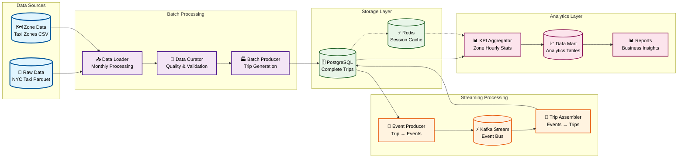

# Data Flow Architecture

## 🔄 Data Processing Pipeline

The ChillFlow pipeline processes NYC taxi data through multiple stages, combining batch and streaming processing for comprehensive analytics.

## 📊 Data Flow Diagram



## 🏗️ Processing Stages

### 1. **Data Ingestion**
- **Raw Data**: NYC taxi parquet files (monthly batches)
- **Reference Data**: Taxi zones, lookup tables
- **Quality Checks**: Data validation and cleaning

### 2. **Batch Processing**
- **Data Loader**: Processes monthly data files
- **Data Curator**: Validates and cleans raw data
- **Batch Producer**: Generates complete trip records
- **Storage**: Saves to PostgreSQL database

### 3. **Streaming Processing**
- **Event Producer**: Splits complete trips into granular events
- **Kafka Stream**: Real-time event streaming
- **Trip Assembler**: Reassembles events into complete trips
- **Storage**: Updates PostgreSQL with processed trips

### 4. **Analytics Processing**
- **KPI Aggregator**: Generates zone-hourly statistics
- **Data Mart**: Pre-computed analytics tables
- **Reports**: Business intelligence and insights

## 🔄 Event Types

### **Trip Events**
- **TripStartedEvent**: Trip initiation
- **TripEndedEvent**: Trip completion
- **PaymentProcessedEvent**: Payment processing
- **ZoneEvent**: Zone-specific events

### **Event Flow**
1. **Trip Started** → Kafka → Assembler
2. **Payment Processed** → Kafka → Assembler
3. **Trip Ended** → Kafka → Assembler
4. **Complete Trip** → Database → Analytics

## 📊 Data Schemas

### **Complete Trip Schema**
```python
class CompleteTrip:
    trip_id: str
    vendor_id: str
    pickup_ts: datetime
    dropoff_ts: datetime
    pickup_zone_id: int
    dropoff_zone_id: int
    passenger_count: int
    fare_amount: float
    tip_amount: float
    total_amount: float
    payment_type: str
```

### **Event Schemas**
```python
class TripStartedEvent:
    event_id: str
    trip_id: str
    vendor_id: str
    pickup_ts: datetime
    pickup_zone_id: int
    passenger_count: int

class TripEndedEvent:
    event_id: str
    trip_id: str
    dropoff_ts: datetime
    dropoff_zone_id: int
    fare_amount: float
    tip_amount: float
    total_amount: float
    payment_type: str
```

## 🚀 Performance Characteristics

### **Batch Processing**
- **Throughput**: ~10,000 trips/minute
- **Latency**: 5-10 minutes (monthly batches)
- **Storage**: PostgreSQL with optimized indexing

### **Streaming Processing**
- **Throughput**: ~1,000 events/second
- **Latency**: <100ms (real-time)
- **Storage**: Kafka + PostgreSQL

### **Analytics Processing**
- **Throughput**: ~100 KPIs/minute
- **Latency**: 1-5 minutes (hourly aggregation)
- **Storage**: Pre-computed data marts

## 🔧 Data Quality

### **Validation Rules**
- **Trip Duration**: 1 second to 24 hours
- **Fare Amount**: $0.01 to $500.00
- **Zone IDs**: Valid taxi zone references
- **Timestamps**: Chronological order

### **Quality Metrics**
- **Completeness**: >99% data coverage
- **Accuracy**: <0.1% validation errors
- **Consistency**: Cross-reference validation
- **Timeliness**: Real-time processing

## 📈 Monitoring & Observability

### **Key Metrics**
- **Data Volume**: Records processed per minute
- **Processing Latency**: End-to-end processing time
- **Error Rates**: Failed validations and processing
- **Resource Usage**: CPU, memory, disk I/O

### **Alerting**
- **Data Quality**: Validation failures
- **Processing Delays**: Latency thresholds
- **Resource Limits**: CPU/memory usage
- **System Health**: Service availability

## 🔄 Data Lineage

### **Source to Destination**
1. **Raw Data** → Data Loader → Curated Data
2. **Curated Data** → Batch Producer → Complete Trips
3. **Complete Trips** → Event Producer → Events
4. **Events** → Trip Assembler → Updated Trips
5. **Updated Trips** → KPI Aggregator → Analytics

### **Data Dependencies**
- **Zones** → Trip validation
- **Trips** → Event generation
- **Events** → Trip assembly
- **Trips** → KPI calculation
- **KPIs** → Report generation
