# System Architecture Overview

## 🏗️ Architecture at a Glance

The ChillFlow pipeline is a modern, event-driven data processing system designed for real-time analytics of NYC taxi data. It combines batch processing for historical data with streaming processing for real-time insights.

## 📊 System Architecture

```mermaid
graph TB
    %% Data Sources
    subgraph "Data Sources"
        NYC[("🗽 NYC Taxi Data<br/>Parquet Files")]
        REF[("📋 Reference Data<br/>Zones, Lookups")]
    end

    %% Ingestion Layer
    subgraph "Ingestion Layer"
        BATCH["📥 Batch Processor<br/>Monthly Data Loading"]
        CURATE["🔧 Data Curation<br/>Quality Checks"]
    end

    %% Streaming Layer
    subgraph "Streaming Layer"
        PRODUCER["📡 Event Producer<br/>Trip → Events"]
        KAFKA[("⚡ Kafka<br/>Event Streaming")]
        ASSEMBLER["🔧 Trip Assembler<br/>Events → Trips"]
        REDIS[("⚡ Redis<br/>State Management")]
    end

    %% Storage Layer
    subgraph "Storage Layer"
        POSTGRES[("🗄️ PostgreSQL<br/>Complete Trips")]
    end

    %% Analytics Layer
    subgraph "Analytics Layer"
        AGGREGATOR["📊 KPI Aggregator<br/>Zone Hourly Stats"]
        REPORTS["📈 Reports<br/>Analytics & Insights"]
    end

    %% Infrastructure (commented out)
    %% subgraph "Infrastructure"
    %%     DOCKER["🐳 Docker<br/>Containerization"]
    %%     CI["🔄 GitHub Actions<br/>CI/CD Pipeline"]
    %%     TERRAFORM["🏗️ Terraform<br/>Infrastructure as Code"]
    %% end

    %% Data Flow
    NYC --> BATCH
    REF --> BATCH
    BATCH --> CURATE
    CURATE --> POSTGRES

    %% Streaming Path
    NYC --> PRODUCER
    PRODUCER --> KAFKA
    KAFKA --> ASSEMBLER
    ASSEMBLER <--> REDIS
    ASSEMBLER --> POSTGRES

    %% Analytics Path
    POSTGRES --> AGGREGATOR
    AGGREGATOR --> REPORTS

    %% Infrastructure connections (commented out)
    %% DOCKER -.-> BATCH
    %% DOCKER -.-> PRODUCER
    %% DOCKER -.-> ASSEMBLER
    %% CI -.-> DOCKER
    %% TERRAFORM -.-> DOCKER

    %% Styling
    classDef dataSource fill:#e1f5fe,stroke:#01579b,stroke-width:2px,color:#000
    classDef processing fill:#f3e5f5,stroke:#4a148c,stroke-width:2px,color:#000
    classDef storage fill:#e8f5e8,stroke:#1b5e20,stroke-width:2px,color:#000
    classDef analytics fill:#fff3e0,stroke:#e65100,stroke-width:2px,color:#000
    %% classDef infrastructure fill:#fce4ec,stroke:#880e4f,stroke-width:2px,color:#000

    class NYC,REF dataSource
    class BATCH,CURATE,PRODUCER,ASSEMBLER,REDIS processing
    class POSTGRES,KAFKA storage
    class AGGREGATOR,REPORTS analytics
    %% class DOCKER,CI,TERRAFORM infrastructure
```

## 🔄 Data Flow

The system processes data through two parallel paths:

### **Batch Processing Path:**
1. **Data Ingestion**: Raw NYC taxi data is loaded and curated
2. **Batch Processing**: Historical data is processed in monthly batches
3. **Database Storage**: Complete trips are written to PostgreSQL

### **Streaming Processing Path:**
1. **Event Generation**: Raw trip data is split into granular events
2. **Event Streaming**: Events are sent to Kafka for real-time processing
3. **Event Assembly**: Events are reassembled into complete trips using Redis for state management
4. **Database Storage**: Reassembled trips are written to PostgreSQL

### **Analytics Path:**
1. **KPI Generation**: Analytics are computed from the complete trips in PostgreSQL
2. **Reporting**: Business intelligence and insights are generated

## 🏗️ Key Components

### **Batch Processing**
- **Data Loader**: Processes monthly NYC taxi data files
- **Data Curator**: Validates and cleans raw data
- **Batch Producer**: Generates complete trip records

### **Streaming Processing**
- **Event Producer**: Reads raw trip data and splits it into granular events (start, end, payment)
- **Kafka**: Event streaming platform for real-time data flow
- **Trip Assembler**: Consumes events from Kafka and reassembles them into complete trips using Redis for state management
- **Redis**: State management for partial trip assembly and caching

### **Storage & Analytics**
- **PostgreSQL**: Primary database for complete trips and analytics
- **KPI Aggregator**: Generates zone-hourly statistics
- **Reports**: Business intelligence and analytics

## 🚀 Deployment Architecture

The system is designed for cloud-native deployment with:

- **Containerization**: Docker for consistent environments
- **Orchestration**: Kubernetes for scalable deployment
- **Infrastructure as Code**: Terraform for reproducible infrastructure
- **CI/CD**: GitHub Actions for automated testing and deployment
- **Monitoring**: Prometheus, Grafana, and Loki for observability

## 🔧 Development Workflow

- **Local Development**: Docker Compose for local testing
- **Code Quality**: pre-commit hooks for automated quality checks
- **Testing**: Comprehensive test suite with Testcontainers
- **CI/CD**: Automated testing and deployment pipeline

## 📈 Scalability & Performance

- **Horizontal Scaling**: Kubernetes-based auto-scaling
- **Event Streaming**: Kafka for high-throughput event processing
- **Caching**: Redis for fast data access
- **Database Optimization**: PostgreSQL with proper indexing and partitioning
- **Monitoring**: Real-time metrics and alerting for performance optimization
