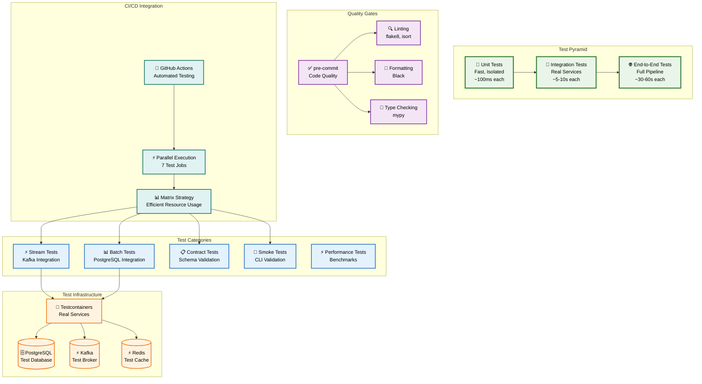

# Testing Strategy

## 🧪 Comprehensive Testing Approach

The ChillFlow pipeline implements a robust testing strategy that ensures reliability, performance, and maintainability across all components.

## 📊 Testing Pyramid



## 🏗️ Test Categories

### **1. Unit Tests**
- **Purpose**: Test individual components in isolation
- **Scope**: Functions, classes, methods
- **Speed**: ~100ms each
- **Coverage**: >90% code coverage
- **Tools**: pytest, unittest.mock

### **2. Integration Tests**
- **Purpose**: Test component interactions with real services
- **Scope**: Database, Kafka, Redis integration
- **Speed**: ~5-10s each
- **Infrastructure**: Testcontainers
- **Tools**: pytest, testcontainers

### **3. Contract Tests**
- **Purpose**: Validate data schemas and transformations
- **Scope**: Pydantic models, API contracts
- **Speed**: ~1-2s each
- **Tools**: pytest, pydantic

### **4. Smoke Tests**
- **Purpose**: Verify basic functionality without dependencies
- **Scope**: CLI commands, component initialization
- **Speed**: ~500ms each
- **Tools**: pytest, mocking

### **5. Performance Tests**
- **Purpose**: Benchmark processing speed and memory usage
- **Scope**: Batch processing, serialization, memory
- **Speed**: ~10-30s each
- **Tools**: pytest, timeit, memory profiling

## 🔧 Test Infrastructure

### **Testcontainers Integration**
- **PostgreSQL**: Real database for integration tests
- **Kafka**: Real message broker for streaming tests
- **Redis**: Real cache for session tests
- **Benefits**: Real service behavior, no mocking complexity

### **Test Data Management**
- **Fixtures**: Reusable test data generators
- **Factories**: Dynamic test data creation
- **Cleanup**: Automatic test data cleanup
- **Isolation**: Each test runs in clean environment

## 🚀 CI/CD Integration

### **Parallel Test Execution**
- **Matrix Strategy**: 7 parallel test jobs
- **Resource Efficiency**: Optimal resource utilization
- **Fast Feedback**: Quick test results
- **Failure Isolation**: Independent test failures

### **Quality Gates**
- **pre-commit**: Local code quality checks
- **Linting**: flake8, isort, black
- **Type Checking**: mypy for type safety
- **Formatting**: Consistent code style

## 📊 Test Metrics

### **Coverage Targets**
- **Unit Tests**: >90% code coverage
- **Integration Tests**: >80% component coverage
- **Contract Tests**: 100% schema coverage
- **Smoke Tests**: 100% CLI coverage

### **Performance Targets**
- **Unit Tests**: <100ms each
- **Integration Tests**: <10s each
- **Smoke Tests**: <1s each
- **Total Suite**: <5 minutes

## 🔄 Test Execution

### **Local Development**
```bash
# Run all tests
make test TYPE=all

# Run specific test suites
make test TYPE=unit
make test TYPE=stream
make test TYPE=batch
make test TYPE=integration
```

### **CI/CD Pipeline**
```bash
# Parallel execution
pytest tests/unit/ -m "not integration"
pytest tests/stream/ -m "not integration"
pytest tests/batch/ -m "not integration"
pytest tests/ -m "integration"
```

## 🛠️ Test Tools

### **Testing Framework**
- **pytest**: Primary testing framework
- **testcontainers**: Real service integration
- **unittest.mock**: Component mocking
- **pytest-cov**: Coverage reporting

### **Quality Tools**
- **pre-commit**: Code quality hooks
- **black**: Code formatting
- **flake8**: Linting
- **isort**: Import sorting
- **mypy**: Type checking

## 📈 Continuous Improvement

### **Test Monitoring**
- **Coverage Reports**: Track test coverage trends
- **Performance Metrics**: Monitor test execution time
- **Failure Analysis**: Identify flaky tests
- **Quality Metrics**: Track code quality trends

### **Test Maintenance**
- **Regular Updates**: Keep test dependencies current
- **Refactoring**: Improve test maintainability
- **Documentation**: Keep test documentation current
- **Best Practices**: Follow testing best practices

## 🎯 Testing Best Practices

### **Test Design**
- **Arrange-Act-Assert**: Clear test structure
- **Single Responsibility**: One test, one purpose
- **Descriptive Names**: Clear test naming
- **Independent Tests**: No test dependencies

### **Test Maintenance**
- **Regular Updates**: Keep tests current
- **Refactoring**: Improve test quality
- **Documentation**: Clear test documentation
- **Best Practices**: Follow testing standards
